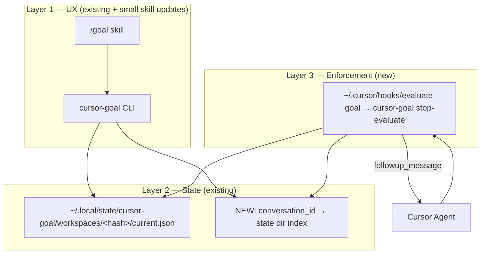

# cursor-goal + global stop hook

Handoff plan for adding **harness-enforced** `/goal` loops to cursor-goal. Synthesizes the prior research (Claude Code `/goal` + Cursor hooks) with this repo’s existing CLI, state, and skill.

**Related docs (do not duplicate here):**

- [`README.md`](../../README.md) — product overview and CLI surface
- [`docs/codex-goal-research.md`](../../docs/codex-goal-research.md) — Codex Goal-mode alignment
- [`docs/install.md`](../../docs/install.md) — skill install today
- [`AGENTS.md`](../../AGENTS.md) — repo constraints for agents

---

## Problem

cursor-goal today is **cooperative**: the in-chat skill tells the agent to checkpoint via `cursor-goal checkpoint`, emit `GOAL_STATUS`, and run verification. Nothing in the Cursor harness **prevents** the agent from stopping early.

Claude Code `/goal` and the intended Cursor equivalent use a **`stop` hook** that runs at every agent turn end and returns either:

- `{}` — allow stop
- `{"followup_message": "..."}` — auto-submit the next user message and continue

This plan adds that hard gate **without** reimplementing cursor-goal’s state machine, lifecycle, or verify runner.

---

## Architecture

```text
User /goal          cursor-goal CLI + skill          Cursor stop hook
──────────          ─────────────────────          ─────────────────
/goal <objective> → set state, --verify cmd   →   (idle until turn ends)
Agent works     →   optional checkpoints      →   on turn end:
                                               load goal by conversation_id
                                               reuse runValidation()
                                               pass → mark complete, {}
                                               fail → followup_message
```



### Design decisions

| Decision | Choice |
|----------|--------|
| State location | Keep workspace-hash dirs under `~/.local/state/cursor-goal/` (existing). Do **not** move to `~/.cursor/goals/` unless migration is explicitly needed. |
| Chat linkage | **New** index file maps `conversation_id` → `stateDir` + `workspace_root`. Written when a goal is set/resumed from a chat that provides an id. |
| Verification | **Reuse** `runValidation()` from `src/validation.ts` — do not duplicate shell execution in the hook script. |
| Enforcement vs checkpoints | Stop hook is the **hard gate**. Checkpoints remain for audit narrative and optional agent-driven progress; they are not required for the hook to block stopping. |
| No active goal | Hook **always runs** when configured ([Cursor hooks docs](https://cursor.com/docs/hooks)); script must exit quickly with `{}`. |
| Cloud Agents | **`stop` hooks are not wired in Cloud Agents** (local IDE only for v1). Document clearly; do not rely on this hook in cloud agent VMs. |

### Stop hook I/O contract

**stdin (JSON):** at minimum `conversation_id`, `status`, `loop_count`, `transcript_path`, `workspace_roots`.

**stdout:**

| Outcome | Output |
|---------|--------|
| Allow stop (no goal, paused, complete, user aborted, budget exhausted) | `{}` |
| Continue working | `{"followup_message": "<evidence-based instruction>"}` |

**hooks.json:** set `"loop_limit": null` on the stop hook entry (Cursor default is `5`).

**exit code:** always `0` for normal outcomes; non-zero means hook crash.

---

## Implementation phases

### Phase 0 — Conversation index

Add minimal persistence so the stop hook can find the active goal for a chat.

**Deliverables:**

- Index store, e.g. `~/.local/state/cursor-goal/conversations/<conversation_id>.json`:

  ```json
  {
    "conversation_id": "…",
    "state_dir": "/path/to/workspace state dir",
    "workspace_root": "/path/to/project",
    "linked_at": "ISO-8601"
  }
  ```

- CLI flags (names flexible): `--conversation-id`, `--workspace-root` on `set` / `resume`
- `clear` / `complete` removes or invalidates the index entry
- Unit tests for index read/write/clear

**Non-goals:** changing the on-disk `GoalState` schema unless a field is strictly required.

### Phase 1 — Stop evaluator command

Add a hook-facing CLI action (proposed name: `stop-evaluate`) that implements the enforcement engine.

**Behavior:**

1. Read stop hook JSON from stdin.
2. If `status !== "completed"` → `{}` (user aborted or error).
3. Resolve goal via conversation index → `loadGoalState(stateDir)`.
4. If no goal or `status !== "active"` → `{}`.
5. If `loop_count >= maxTurns` (reuse `budgetStopReason` / existing budget logic) → mark `budget_limited`, `{}`.
6. Run `runValidation()` with the goal’s configured verify command and `cwd`.
7. If validation fails → append audit (run log or history event), return `followup_message` with truncated output + reason.
8. If validation passes (or skipped with no verify cmd and policy allows) → mark `complete`, `{}`.

**Deliverables:**

- New module(s) under `src/` (keep small and testable)
- `cursor-goal stop-evaluate` wired in `args.ts` / `index.ts`
- Tests with fixture stdin JSON and mock validation (no real shell in unit tests where avoidable)
- Thin wrapper script shipped for hooks, e.g. `scripts/evaluate-goal.sh` → `node …/dist/index.js stop-evaluate`

**Reuse (do not reimplement):**

- `runValidation()`, `assertSafeCommand()` — `src/validation.ts`
- `budgetStopReason()`, completion transitions — `src/loopPolicy.ts`, `src/state.ts`
- `formatGoalStatus()` for follow-up message context

### Phase 2 — Hook installer + skill update

**Hook installer** (mirror `scripts/install-skill.sh`):

- `cursor-goal-install-hook --global` (or extend install script with a flag)
- Writes `~/.cursor/hooks.json` (merge safely if file exists) with:

  ```json
  {
    "version": 1,
    "hooks": {
      "stop": [{
        "command": "<absolute path to evaluate-goal wrapper>",
        "loop_limit": null,
        "timeout": 120
      }]
    }
  }
  ```

- Resolves absolute path to the wrapper via npm global root / package location (same pattern as skill installer)
- Include `evaluate-goal.sh` and hook entry in npm `files` if shipped

**Skill update** (`.cursor/skills/goal/SKILL.md`):

- When setting/resuming a goal, pass `--conversation-id` from hook context when available (document how the agent obtains it, or defer to a follow-up if Cursor does not expose it to the skill yet)
- State clearly: **“You are not done until the stop hook allows stop. Do not declare completion; verification at turn end is authoritative when a hook is installed.”**
- Keep checkpoint flow for audit; de-emphasize it as the enforcement mechanism when hook is present

**Docs:**

- Extend [`docs/install.md`](../../docs/install.md) with hook install + local-IDE-only caveat
- Add a short “manual test” section (below) or link from [`docs/smoke-test.md`](../../docs/smoke-test.md)

### Phase 3 — Later (out of scope for initial PR series)

- **Soft LLM judge** — optional second layer for fuzzy NL criteria; read `transcript_path` after hard checks pass; user-supplied API key only; no telemetry
- **Command discovery** — auto-detect `npm test` / `lint` / `build` from repo manifests when `--verify` omitted
- **Unified installer** — `cursor-goal-install --global` for skill + hook
- **Verifier subagent** — optional readonly subagent for complex filesystem truth
- **Cloud `stop` hook support** — re-enable when Cursor ships it; no code path should assume cloud today

---

## Security and repo constraints

From [`AGENTS.md`](../../AGENTS.md) and the prior cursor-goal audit:

- **No new runtime dependencies.** No agent-runtime SDKs.
- **No network calls** in Phases 0–2 (soft judge is Phase 3).
- **No telemetry.** Do not log secrets.
- **Treat `--verify` like `bash -c`** — same destructive-command guards as today (`assertSafeCommand`).
- **Verification is source of truth** when configured; hook must not accept completion on failed verify.
- **Keep generated/build artifacts out of source** except release process (`dist/` via `npm run build`).

---

## Acceptance criteria (manual, local IDE)

Requires: global skill installed, global stop hook installed, Node 22+, a repo with a failing then passing verify command.

1. `cursor-goal-install-skill --global` and hook installer succeed.
2. In Cursor Agent chat (local IDE, not Cloud Agent):
   - `/goal Fix the deliberately failing test; verify with npm test`
   - Agent makes a change but tries to stop with tests still failing.
3. Stop hook returns `followup_message`; agent continues without manual re-prompt.
4. After fix, hook runs verify → passes → goal status `complete`, agent allowed to stop (`{}`).
5. Normal chat **without** an active goal: hook returns `{}` immediately; no spurious loops.
6. `/goal clear` or completed goal: subsequent turn ends do not loop.
7. `npm test` in this repo still passes after changes.

---

## Suggested implementation order for agents

1. Read this plan and skim existing modules cited above.
2. Implement **Phase 0** with tests; commit.
3. Implement **Phase 1** with tests; commit.
4. Implement **Phase 2** (installer + skill + docs); commit.
5. Run full manual acceptance in local Cursor IDE before claiming done.

**First message for a fresh implementation agent:**

> Implement `.cursor/plans/cursor-goal-stop-hook.plan.md` phase by phase. Start with Phase 0–2.

---

## References

- [Cursor hooks documentation](https://cursor.com/docs/hooks) — stop hook contract, `loop_limit`, cloud gaps
- [Cursor agent best practices — grind until done](https://cursor.com/blog/agent-best-practices) — stop hook + skill pattern
- Prior research transcript: cloud agent `bc-019f1683-7e2b-795e-a729-a4274f1c41dd` (“Replicating /goal in Cursor”)
